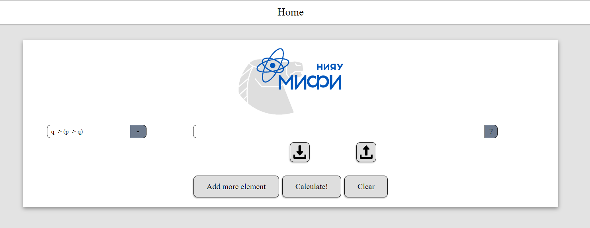

# logicalverifier

--- THIS IS COPY FROM DEPRICATED GITLAB REPOSITORY https://gitlab.com/v.zaytsev/logical-verifier-old ---

It is result of team work for "project practice" course in NRNU MEPhI

This is our main page

You can
1) Input several logic formulas
2) Check if formulas in this chain is correct
3) Import and export the result
4) Get list of all axioms (left)

There is three axioms
* q -> (p -> q)
* (s -> (p -> q)) -> ((s -> p) -> (s -> q))
* ((p -> f) -> f) -> p
